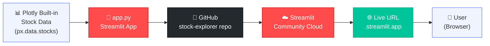
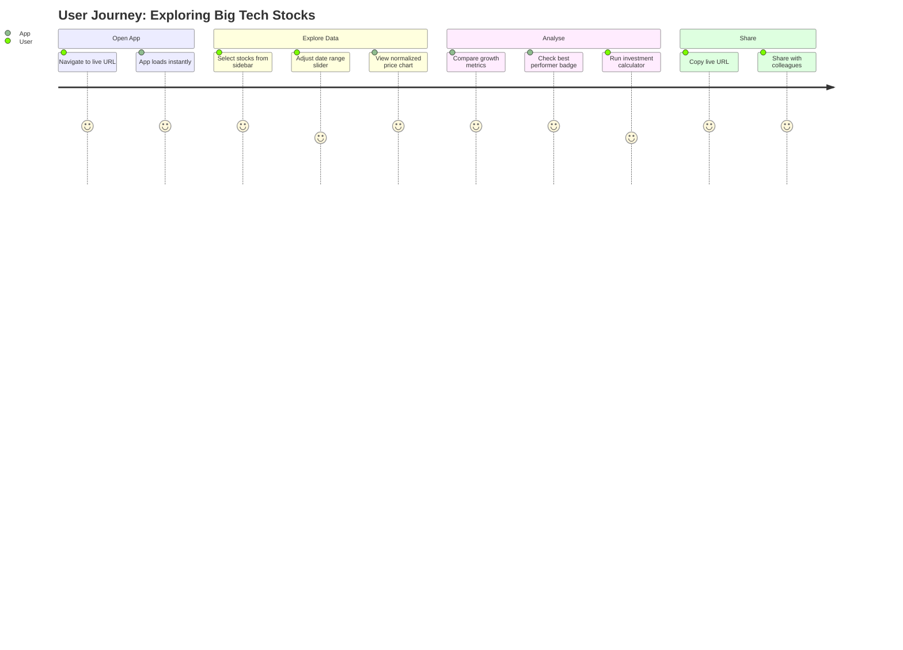

# 📈 Stock Price Explorer

A Streamlit web app that lets you compare how the big tech stocks (AAPL, GOOG, MSFT, AMZN, NFLX, FB) have grown since January 2018.

**Live app:** _[paste your Streamlit Cloud URL here after deploying]_

---

## Features

- **Normalized price chart** — compare growth on the same scale
- **Best performer badge** — highlights the top stock in your selection
- **Date-range slider** — zoom into any period since Jan 2018
- **Investment calculator** — "what if I invested $1,000?"
- **Growth bar chart** — side-by-side total growth comparison
- **Volatility indicator** — which stock bounced around the most
- **Did you know?** — a real-world fact fetched about Apple's history
- **Custom dark theme** — branded red-on-dark colour scheme via `.streamlit/config.toml`

---

## Architecture

### How the app is built and delivered




### User journey




---

## Quick start

```bash
pip install streamlit pandas plotly
streamlit run app.py
```

---

## Files

| File | Purpose |
|------|---------|
| `app.py` | Main Streamlit application |
| `requirements.txt` | Python dependencies for Streamlit Cloud |
| `.streamlit/config.toml` | Custom dark theme |
| `.gitignore` | Keeps secrets and temp files out of git |
| `README.md` | This file |
| `Reflection.txt` | Personal reflection on the build process |

---

## Reflection

Building this app showed how powerful MCP skill packs are for accelerating development. **Context7** was the most helpful — it ensured the Streamlit code used up-to-date APIs rather than deprecated patterns. The most surprising thing was how seamlessly **Playwright** acted as a robot QA tester: it opened the live URL, waited for the app to wake up, and took a screenshot entirely on its own — no manual browser interaction needed.
