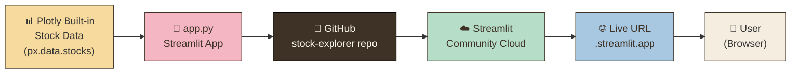
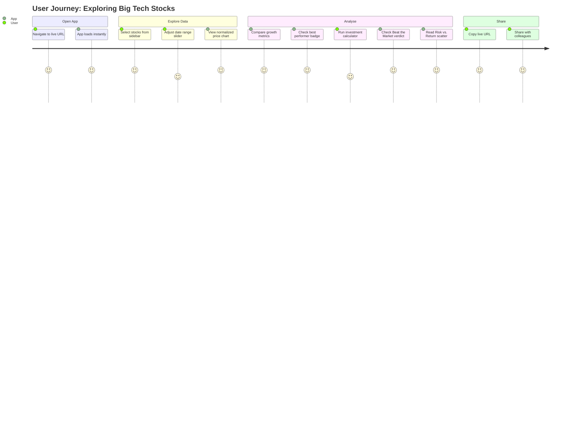

# 📈 Stock Price Explorer

A Streamlit web app that compares how big tech stocks (AAPL, GOOG, MSFT, AMZN, NFLX, FB) have grown since January 2018.

**Live app:** https://stocks-projectgit-ekaqctnd4kgv2sqeiwewyt.streamlit.app/
**GitHub repo:** https://github.com/krumpledecva/Stocks-project

---

## Features

- **Normalized price chart** — compare growth on the same scale
- **Best & least performer badges** — 🏆 top stock, 📉 bottom stock highlighted automatically
- **Date-range slider** — zoom into any period since Jan 2018
- **Investment calculator** — "what if I invested $1,000?" per stock
- **Growth bar chart** — side-by-side total growth comparison
- **Volatility indicator** — which stock bounced around the most
- **Beat the Market** — each stock vs. the equal-weighted Big Tech average, with ✅/❌ verdict
- **Risk vs. Return scatter** — growth % vs. volatility for all stocks, with quadrant lines
- **Rotating "Did you know?"** — real facts fetched about Apple, Microsoft, Google, Amazon, Netflix and Meta; new fact every 30 seconds

---

## Architecture

### How the app is built and delivered




### User journey




---

## Quick start

```bash
pip install streamlit pandas plotly streamlit-autorefresh
streamlit run app.py
```

---

## Files

| File | Purpose |
|------|---------|
| `app.py` | Main Streamlit application |
| `requirements.txt` | Python dependencies for Streamlit Cloud |
| `.streamlit/config.toml` | Warm parchment colour theme |
| `.gitignore` | Keeps secrets and temp files out of git |
| `README.md` | This file |

---

## Reflection

The MCP that helped me the most was **GitHub** — it pushed my code to a public repository with a single instruction, which I would not have known how to do on my own. **Fetch** was also very useful because it pulled real facts about the companies straight from the web, so the "Did you know?" section in the app shows genuine information instead of something I had to make up. The thing that surprised me most was **Playwright** — I expected to have to open a browser myself and take a screenshot manually, but it opened the live app, waited for it to load, and took the screenshot completely on its own, like a real QA tester. I ended up adding extra features like a Beat the Market indicator and a Risk vs. Return chart, and I was surprised by how easy it was to keep adding things just by describing what I wanted in plain English.
